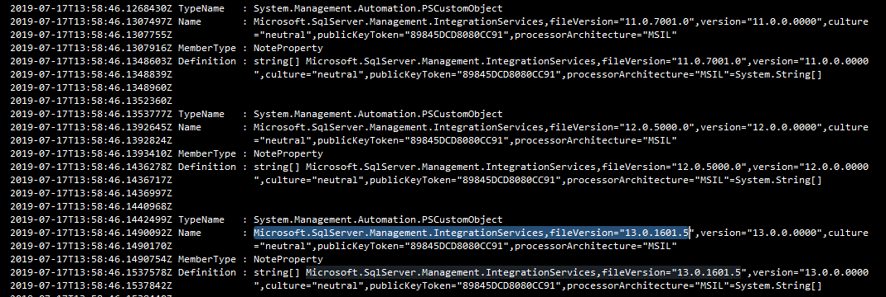

Deploying SSIS packages from Azure Devops with a Microsoft-hosted agent 
==================================

> _Discover how to deploy your SSIS packages from Azure DevOps using the Microsoft-hosted agent pool!_

We are currently working for a customer who wants to migrate their on-prem SSIS workloads to the cloud by running them in Azure Data Factory. This naturally involves building and deploying the SSIS packages in Azure DevOps with the Microsoft-hosted agents. Deploying SSIS packages using the Microsoft-hosted agents in Azure DevOps sounds like a task that should be fairly easy to accomplish but we recently noticed that this is not the case.

We decided to follow <a href="https://docs.microsoft.com/en-us/sql/integration-services/lift-shift/ssis-azure-deploy-run-monitor-tutorial?view=sql-server-2017#deploy-a-project-with-powershell">the official Microsoft guidelines</a> which lists a PowerShell script to deploy a project. We adopted the script which ran fine on our local machines but quickly ran into a problem using the DevOps hosted agents.

The problem resides in the following PowerShell line which load an assembly from the GAC:

<code>[System.Reflection.Assembly]::LoadWithPartialName("Microsoft.SqlServer.Management.IntegrationServices") | Out-Null;</code>

When running it on a hosted agent VS2017 the following error is thrown:

<code>New-Object : Cannot find type [Microsoft.SqlServer.Management.IntegrationServices.IntegrationServices]: verify that the assembly containing this type is loaded.</code>

Which indicates that the <em>‘Microsoft.SqlServer.Management.IntegrationServices.IntegrationServices’</em> dll cannot be found on the hosted agent.
<h2>How did we fix it?</h2>
Performing further research, we find that other people have been setting up self-hosted agents to work around this problem and to be able to deploy SSIS packages from Azure DevOps. Setting up a self-hosted agent to work around the problem is a viable option but feels a bit like an overkill for a simple missing dll.

After discussing this issue with the Microsoft Data Factory &amp; SSIS product group we received the following feedback:

<em>Hosted Agent 2017 installs SSDT for VS2017, which installs the SSIS binaries into GAC for SQL version 2016 (13.0.0.0) and before. Binaries for SQL version 2017 and above are not installed to GAC. They are installed to app-local folder in VS. If your script references to the 13.0.0.0 version, it should work</em>.

Taking that feedback into account we adjusted the PowerShell script to retrieve a specific version of the assembly from the GAC and used the PowerShell command <em>‘Add-Type’</em> instead of <em>‘[System.Reflection.Assembly]::LoadWithPartialName’</em>:

<code>Add-Type -AssemblyName 'Microsoft.SqlServer.Management.IntegrationServices, Version=13.0.0.0, Culture=neutral, PublicKeyToken=89845dcd8080cc91'</code>

Which no longer throws an error in the release pipeline and SSIS packages are deployed correctly!
<h2>Every problem is a lesson</h2>
From every good problem there's a few lessons learned to take with you in the future. These are those lessons learned for this problem:
<ol>
 	<li>There's a difference in the PowerShell commands <em>'LoadWithPartialName'</em> and <em>'Add-Type -AssemblyName'</em>, but what is it? <a href="https://www.madwithpowershell.com/2013/10/add-type-vs-reflectionassembly-in.html">This</a> blogpost is a good read on the topic. It’s a bit lengthy so I’ll just give the quick gist of it:</li>
<em>When using 'LoadWithPartialName' or 'Add-Type' without specifying Version, Culture and PublicKeyToken PowerShell checks against an internal table if an assembly is available on the host system (any version of that assembly). When using 'Add-Type' with Version, Culture and PublicKeyToken specified PowerShell will perform an actual lookup in the GAC instead of using the internal table.</em>
 	<li>Now we know that we can do more in a DevOps hosted agent by loading specific versions of an assembly in our PowerShell scripts the next question arises: how do we know what assemblies are in the GAC of a DevOps hosted agent? DevOps hosted agents have good documentation on their capabilities, you can find the Hosted VS2017 capabilities over <a href="https://github.com/microsoft/azure-pipelines-image-generation/blob/master/images/win/Vs2017-Server2016-Readme.md">here</a> for example! Yet that doesn’t really give you a view of what assemblies those capabilities translate into specifically. In other words: it would be handy to get a view of what exactly is in the GAC of a DevOps hosted agent. For this purpose you can use the PowerShell commands below to get a full list:</li>
</ol>

<code>New-PSDrive -Name HKCR -PSProvider 'Microsoft.PowerShell.Core\Registry' -Root HKEY_CLASSES_ROOT
Get-ItemProperty -Path 'HKCR:\Installer\Assemblies\Global' | Get-Member -MemberType NoteProperty</code>

And yes, after running it we indeed see the <em>'Microsoft.SqlServer.Management.IntegrationServices'</em> assembly with version 13 popping up in the list along with other available versions:

Hope this helps anyone!

Thanks for reading,

Michiel.